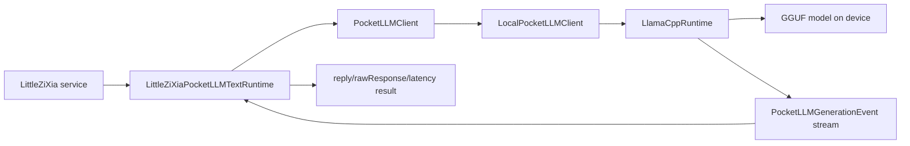

# LittleZiXia SDK Text Integration Plan

Updated: 2026-04-29

## Baseline

PocketLLM is now ready to be treated as a Swift SDK candidate for LittleZiXia text inference. The current baseline is commit `cbaa164 Improve DeepSeek native generation quality`, with real Mac and iPhone GGUF smoke evidence from run id `quality-deepseek-template-20260428T235557Z`.

The verified smoke model is the local Ollama `deepseek-coder:1.3b` GGUF handoff at:

```text
.build/ollama-handoff/deepseek-coder-1.3b.gguf
```

That run proved:

- Mac and iPhone load the same model file by file name, byte size, and SHA-256.
- Mac generated 16 clean token pieces at 2.58 tokens/sec.
- iPhone generated 27 clean token pieces at 8.97 tokens/sec.
- Response previews no longer contain ChatML or DeepSeek template residue such as `<|im_`, `### Instruction:`, or `### Response:`.

## Goal

Integrate PocketLLM into LittleZiXia as a Swift Package/runtime for the first text main chain. The first integration should let LittleZiXia call the phone-local runtime directly for text generation, without Tailscale, without `127.0.0.1:11434`, and without a local HTTP server.

The first text scope is:

- Task planning text generation.
- Developer sandbox and code-generation text generation.
- Multimedia collaboration chat text replies.

Image, audio, video, OCR, speech, and other multimodal routing stay on the existing LittleZiXia paths for this stage.

## SDK Boundary

PocketLLM should be consumed through the existing package products:

- `LittleZiXiaPocketLLM`: storage, models, sessions, client protocol, deterministic runtime, and shared types.
- `LittleZiXiaPocketLLMLlama`: optional native llama.cpp GGUF runtime.

The LittleZiXia main app should not talk to llama.cpp directly. It should depend on these public boundaries:

- `PocketLLMClient`: the app-facing entry point.
- `LocalPocketLLMClient`: client implementation that owns model lookup and delegates to a runtime.
- `PocketLLMRuntime`: runtime abstraction for real and mock generation.
- `LlamaCppRuntime`: real local GGUF inference implementation.
- `DeterministicPocketLLMRuntime`: deterministic test/mock implementation.

Current `PocketLLMClient` capabilities are enough for the first SDK bridge:

```swift
func listModels() async throws -> [PocketLLMModel]
func load(modelID: UUID) async throws
func unload() async
func streamChat(
    messages: [PocketLLMChatMessage],
    parameters: PocketLLMInferenceParameters
) async throws -> AsyncThrowingStream<PocketLLMGenerationEvent, Error>
func cancel() async
func runtimeStatus() async -> PocketLLMRuntimeStatus
```

## First LittleZiXia Entry Points

The first implementation round in the LittleZiXia main repo should audit the dirty working tree before editing, then wire the SDK behind a small adapter instead of replacing every model caller at once.

Candidate entry points:

- `TaskPlannerLLMService` in `ViewController.swift`
  - Current role: produces JSON task plans and dependency inference through OpenAI-compatible `/chat/completions`.
  - First SDK usage: route `plan(...)` through PocketLLM when local text runtime is enabled and a model is loaded.
  - Keep existing rule fallback and network/cloud path when PocketLLM is unavailable or returns invalid JSON.

- `DevSandboxLLMService` in `ViewController.swift`
  - Current role: turns a user prompt into generated script/web code through OpenAI-compatible `/chat/completions`.
  - First SDK usage: route simple text/code generation through PocketLLM.
  - Preserve current `GenerateAttempt` result shape so UI and diagnostics do not change.

- `MultimediaCollabChat` text chat path
  - Current role: sends system prompt, user text, and history to `chatReply(...)`.
  - First SDK usage: route text-only chat prompts through PocketLLM.
  - Do not route image, audio, video, OCR, or tool-result-specific media payloads to PocketLLM in v1.

Developer diagnostics that still mention `http://127.0.0.1:11434/v1` can be adjusted after these user-facing text paths prove stable.

## Main App Adapter

Add one lightweight adapter in the LittleZiXia main project, suggested name:

```swift
LittleZiXiaPocketLLMTextRuntime
```

It should hide PocketLLM streaming details from existing services and expose one text method:

```swift
func generateText(
    systemPrompt: String,
    userPrompt: String,
    history: [String],
    temperature: Double,
    maxTokens: Int
) async -> LittleZiXiaPocketLLMTextResult
```

Suggested result type:

```swift
struct LittleZiXiaPocketLLMTextResult {
    let reply: String?
    let rawResponse: String?
    let error: String?
    let latencyMs: Int
    let generatedTokenCount: Int
    let tokensPerSecond: Double
    let fallbackReason: String?
}
```

The adapter should be initialized with:

```swift
let client: any PocketLLMClient
```

For production, construct it with `LocalPocketLLMClient` plus `LlamaCppRuntime`. For tests, construct it with `LocalPocketLLMClient` plus `DeterministicPocketLLMRuntime`, or with a minimal `PocketLLMClient` fake if a service test does not need model-store behavior.

## Data Mapping

Input mapping:

- `systemPrompt` maps to `PocketLLMChatMessage(role: .system, content: systemPrompt)` when non-empty.
- Each non-empty `history` item maps to a `PocketLLMChatMessage`. For the first bridge, keep the current LittleZiXia semantics and map history strings as `.user`; a later pass can introduce structured user/assistant turns if the main repo exposes that detail.
- `userPrompt` maps to the final `.user` message.
- `temperature` maps to `PocketLLMInferenceParameters.temperature`.
- `maxTokens` maps to `PocketLLMInferenceParameters.maxTokens`.
- Keep PocketLLM defaults for context length, top-p, thread count, and seed unless a specific LittleZiXia setting is added later.

Streaming mapping:

- On `.started`, capture the start time if the adapter did not already capture it.
- On `.token(let text, _)`, append `text` to an accumulator.
- On `.metrics(let metrics)`, keep the latest `generatedTokenCount` and `tokensPerSecond`.
- On `.completed(let finalText)`, prefer `finalText` when it is non-empty; otherwise keep the accumulated token text.
- Trim the final text before returning it as `reply`.
- Set `rawResponse` to a compact local-runtime trace string or JSON object that includes runtime name, generated token count, tokens/sec, and final text. Existing callers can keep displaying `rawResponse` in diagnostics without assuming HTTP response JSON.

Suggested flow:



## Availability And Fallback

The first integration should be fail-soft:

- If no model is imported, return `reply: nil` with `fallbackReason: "pocketllm_no_model"`.
- If the runtime is not loaded, return `fallbackReason: "pocketllm_not_loaded"` and let the existing service choose cloud/rule fallback.
- If load or generation throws, return the localized error and `fallbackReason: "pocketllm_generation_failed"`.
- If the caller cancels, call `PocketLLMClient.cancel()` and map the result to the existing cancellation semantics.
- If output is empty after trimming, return `fallbackReason: "pocketllm_empty_response"`.
- If a caller needs strict JSON, such as `TaskPlannerLLMService`, validate JSON after generation and fall back to the existing planner rules or cloud path if decoding fails.

The adapter should not throw errors directly into SwiftUI screens. Existing LittleZiXia services already have `reply/rawResponse/error/latencyMs` result objects; the SDK bridge should preserve that style.

## Non-goals

This stage explicitly does not:

- Implement an HTTP server.
- Implement an Ollama-compatible or OpenAI-compatible local API server.
- Replace the existing cloud model configuration UI.
- Remove the current `/chat/completions` code paths.
- Handle image, audio, video, OCR, speech, or tool media routing.
- Edit the dirty LittleZiXia main repo in the documentation round.

## Implementation Sequence

1. Audit the LittleZiXia main repo dirty worktree and record which files are user work.
2. Add `LittleZiXiaPocketLLM` as a local Swift Package dependency, using the sibling checkout first.
3. Add `LittleZiXiaPocketLLMTextRuntime` and its result type in the main app, without changing existing callers.
4. Add adapter tests with `DeterministicPocketLLMRuntime` to prove message mapping, stream merging, metrics capture, empty output handling, and cancellation.
5. Gate `TaskPlannerLLMService.plan(...)` behind a runtime selection flag or preference, then validate generated JSON before accepting it.
6. Wire `DevSandboxLLMService.generate(...)` through the same adapter and preserve `GenerateAttempt`.
7. Wire the `MultimediaCollabChat` text-only `chatReply(...)` path after planner and sandbox behavior are stable.
8. Only after the text path is stable, consider diagnostics UI that shows local PocketLLM status beside the existing Ollama/cloud probe.

## Future Acceptance Criteria

The first implementation round in the LittleZiXia main repo should pass:

- LittleZiXia can select PocketLLM for text inference without changing image/audio/video behavior.
- If no PocketLLM model is loaded, LittleZiXia falls back to the existing rule/cloud path and does not crash.
- With `deepseek-coder:1.3b` loaded, LittleZiXia completes one local text generation round on Mac.
- With `deepseek-coder:1.3b` loaded, LittleZiXia completes one local text generation round on the connected iPhone.
- `TaskPlannerLLMService` still rejects invalid planner JSON and keeps the existing fallback.
- `DevSandboxLLMService` still returns the existing `reply/rawResponse/error/latencyMs` style result.
- `MultimediaCollabChat` text-only replies can use PocketLLM, while media routes stay on current paths.
- PocketLLM itself still passes `scripts/verify-local.sh`.
- LittleZiXia main repo passes its agreed Mac and iPhone build/test baseline for that round.

## Next Round Decision

The next coding round should happen in the LittleZiXia main repo only after a separate dirty-worktree audit. The smallest useful implementation slice is the adapter plus tests, before any user-facing service switches over.
